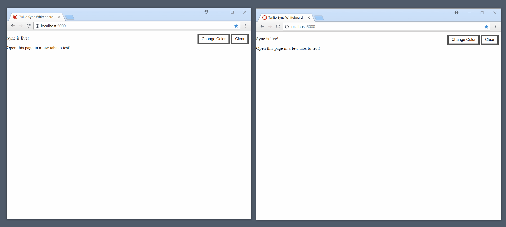

# Twilio Whiteboard

This is a simple collaborative whiteboard build with Flask and Twilio Sync.



## Installation

Clone the repo and build the environment:
```
$ git clone https://github.com/greyli/twilio-whiteboard
$ cd twilio-whiteboard
$ python3 -m venv venv  # use "python -m venv venv" on Windows
$ . venv/bin/activate  # use "venv\Scripts\activate" on Windows
(venv) $ pip install -r requirements.txt
```

Rename the `.env.example` to `.env`, fill the variables in it (You will need to register a free [Twilio account](http://www.twilio.com/referral/w6qBg0)).

Run the application with:
```
(venv) $ flask run
```

Then open http://localhost:5000 on two or more tabs to test.
